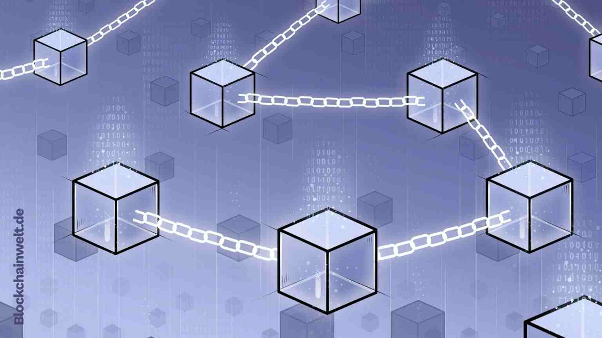

# Базовое представление блокчейна на языке Go

Блокчейн - это одна из самых революционных технологий 21 века, которая находится на стадии активного развития и еще не раскрыла все свои возможности. Суть блокчейна заключается в его способности представлять собой распределенную базу данных записей. Однако, то, что делает его поистине уникальным, это то, что он не является частным, а общедоступным реестром, где каждый участник имеет полную или частичную копию базы данных.

Ключевой фактор, отличающий блокчейн от традиционных баз данных, заключается в том, что новые записи могут быть добавлены только с согласия других участников сети. Этот механизм консенсуса гарантирует непреложную достоверность и безопасность данных в блокчейне. Каждый блок, содержащий новую информацию, связывается с предыдущим блоком с помощью шифрования, что делает процесс изменения данных практически невозможным без изменения всех последующих блоков.

Именно благодаря своей уникальной структуре блокчейн стал фундаментом для создания криптовалюты, такой как Биткойн, и расширил возможности финансовых операций. Вместе с тем, блокчейн сделал возможными такие инновации, как смарт-контракты, которые предоставляют надежный и автоматизированный способ заключения сделок без промежуточных лиц.

Однако потенциал блокчейна не ограничивается только финансовой сферой. Его применение может быть найдено в различных отраслях, таких как логистика, право, медицина, государственное управление и технологии цепи поставок. Технология блокчейн обладает большими перспективами в обеспечении прозрачности, безопасности и эффективности во многих аспектах нашей жизни.

## Хранение структуры
В Golang эта структура может быть реализована с помощью массива и карты: массив сохранял бы упорядоченные хэши (массивы упорядочены в Go), а карта сохраняла бы hash → block пары (карты неупорядочены). Но для нашего прототипа блокчейна мы будем просто использовать массив, потому что нам пока не нужно получать блоки по их хэшу.

## Заключение

В заключение, блокчейн - это не просто распределенная база данных, но и технология, способная изменить наш с вами мир. Его уникальные возможности в области безопасности, автоматизации и децентрализации подтверждают его революционный потенциал. Поэтому блокчейн продолжает привлекать внимание разработчиков, предпринимателей и исследователей, открывая новые горизонты для будущего развития и инноваций.
